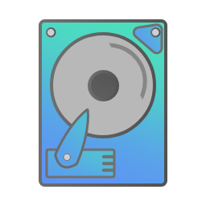
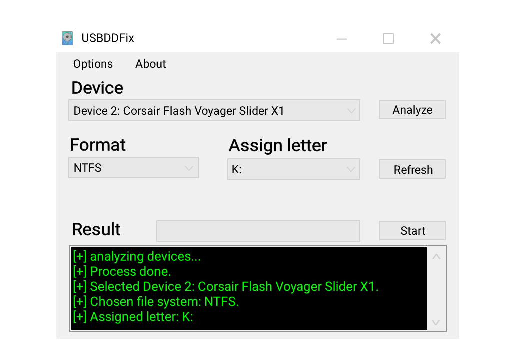

  

<h1 align="center">USB DD Fixer</h1>

  
  
  
  
   
  
  
  
  

---

## Description

USB DD Fixer is a software designed to restore USB drives that have been formatted or damaged by using disk imaging (Disk Dump) writing methods. This tool allows users to regain access to their USB devices quickly and easily.
  

## 📝 Table of Contents
- [Characteristics](#char)
- [Getting Started](#start)
- [Compatibility](#compatibility)
- [Requirements](#requirements)
- [Usage](#usage)
- [Download](#downloads)
- [Contributing](#contributing)
- [Authors](#authors)
- [License](#license)

## ❓ About
Many times popular tools can damage the USB device, such as using the DD function in Rufus.
There are disk partitioning tools, but we personally tested 90% of them and they generate errors or exceptions because they cannot make a proper repair for situations of this type. On the other hand, there are tools that promise to repair such errors, but they are paid tools.
To save you a headache, we developed this software that does everything quickly and easily, without so many twists and turns or complex processes.

## 🗃️ Characteristics 

- **Intuitive Interface:** Simple, clean and easy to use.

- **Universal:** Repair any USB drive of any brand and model.

- **performance:** By not using external dependencies, it only weighs 64kb.

- **Adaptive:** Use light/dark theme to protect your eyes depending on your environment.

## 🚀 Getting Started 
To start using this program you must have one of the following operating systems and requirements:

## ⚙️ compatibility 
  
- **Operative System:** 
  - Windows 7.
  - Windows 8.
  - Windows 8.1
  - Windows 10.
  - Windows 11.

## 🔩 Requirements 
For this software to work, you need to have at least <strong>Net Framework 4.0</strong> installed.

## 🎈 Usage 

  

- **Device:** This is the USB device you want to repair.
- **Analyze:** Search for the storage drives connected to your computer.
- **Fomat:** This is the format you want to give to your device's file system.
- **Assign letter:** These are the letters available to assign to your device.
- **Refresh:** Updates available letters (in case of removing a device).
- **Start:** Start the repair process.
- **Result:** Displays the progress status of the repair.

## 🔽 Download 
For now you can download the compiled project from the github releases.

  

## 🔨 Contributions 

Every contribution is welcome. Don't feel ashamed. if you want to help, follow these steps:

1. Fork this repository.

2. Create a new branch (git checkout -b feature/new-feature).

3. Make the necessary changes and commit them (git commit -m 'Add new feature').

4. Push to the branch (git push origin feature/new-feature).

5. Open a Pull Request.

---

## 🌄 Authors 
- [@SimulatedRealitySoft](https://github.com/SimulatedRealitySoft) - Software Distribution - Idea.

- <strong>Diego Calveyra - Developer and programmer.</strong>

## License 

> USB DD Fixer (c) 2024 Simulated Reality Soft
> 
> This is free software: you can redistribute it and/or modify it under the terms of the GNU General Public License as published by the Free Software Foundation, either version 3 of the License, or (at your option) any later version.
> 
> This software is distributed in the hope that it will be useful, but WITHOUT ANY WARRANTY; without even the implied warranty of MERCHANTABILITY or FITNESS FOR A PARTICULAR PURPOSE. See the GNU General Public License for more details.
> 
> You should have received a copy of the GNU General Public License along with this app. If not, see https://www.gnu.org/licenses/.
